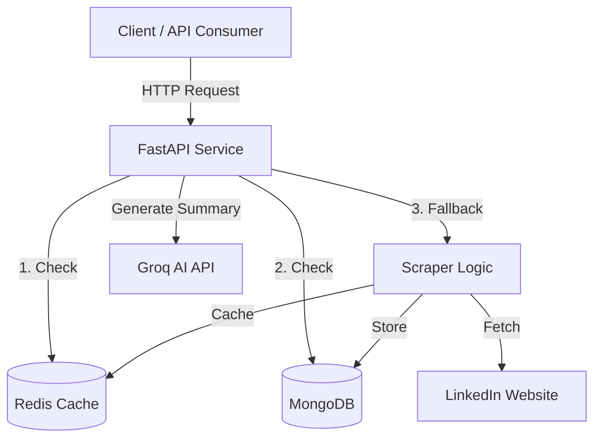
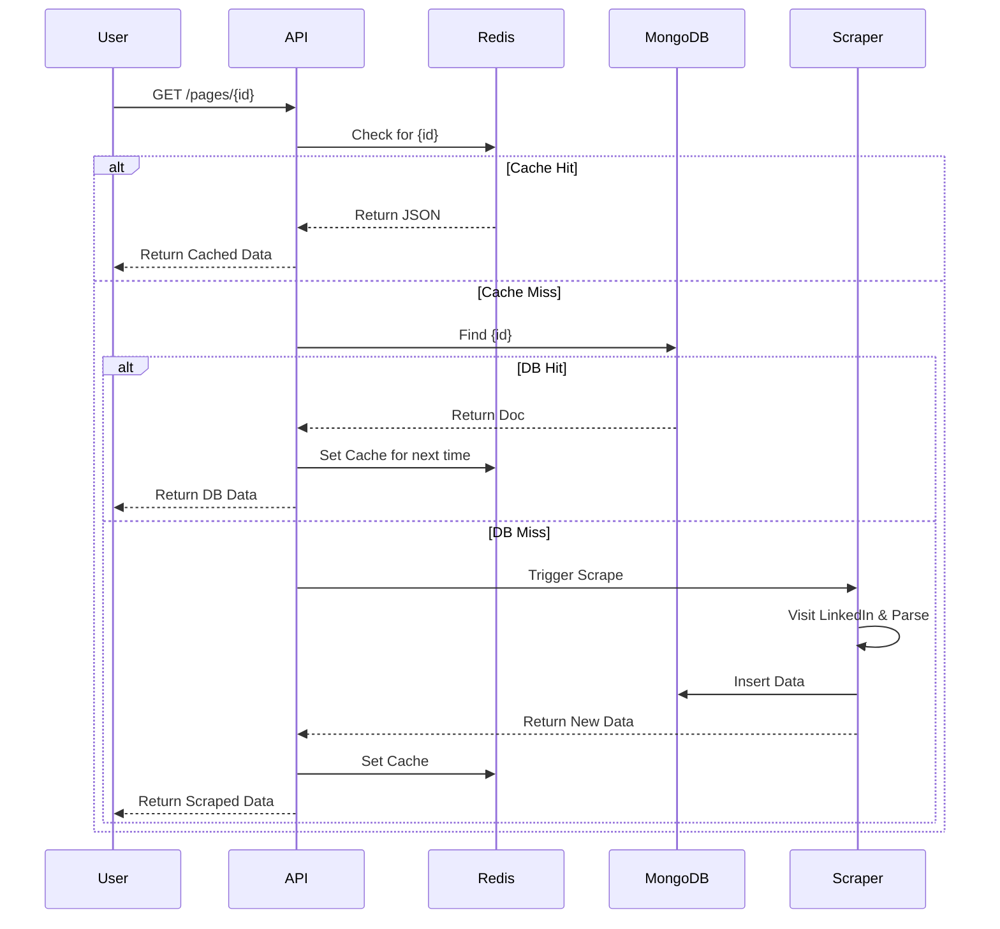

# LinkedIn Insights Microservice
## Issue
 Businesses require current LinkedIn company data (followers, posts, employees), but static databases quickly become outdated and official APIs are frequently costly or restricted.


 ## Method
 A **Hybrid Real-Time Architecture** is implemented by this microservice:
 1. On-Demand Scraping: This method uses a headless browser to retrieve new data only as needed.
 2. Redis is used for "smart caching," which minimizes scraper load by instantly fulfilling frequent requests.
 3. Persistence: Maintains historical data in MongoDB for backup and analytics purposes.

## Architecture



**Core Components:**
*   **FastAPI**: Entry point, handles HTTP requests and routing.
*   **Redis**: In-memory cache for sub-millisecond data retrieval.
*   **MongoDB**: Persistent storage for scraped profiles and posts.
*   **Scraper**: Headless browser (Playwright) to fetch fresh data from LinkedIn.
*   **Groq AI**: Generates summaries using Llama-3 models.

## Data Flow



**Strategy: "Cache First, Scrape Last"**
1.  **Cache**: Fastest. Checks memory first.
2.  **DB**: Reliable. Checks disk if cache is empty.
3.  **Scrape**: Fallback. Only connects to LinkedIn if data is completely missing.


## Setup

1.  **Install**:
    ```bash
    pip install -r requirements.txt
    playwright install
    ```
2.  **Run**:
    ```bash
    python run.py
    ```
3.  **Docs**: Visit `http://localhost:8000/docs`

## Tech Stack
*   **FastAPI** (Async API)
*   **MongoDB** (Storage)
*   **Redis** (Caching)
*   **Playwright** (Scraping)
*   **Groq AI** (Summaries)